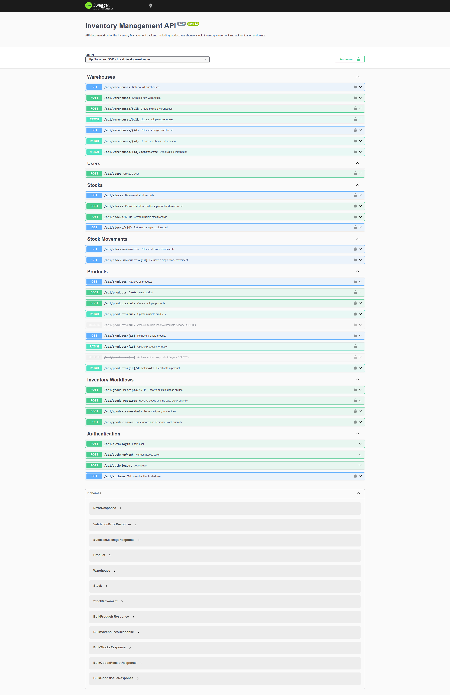

# Inventory Management API


A backend API for managing products, warehouses and stock movements in a simple inventory management system.

## Project Goal

The goal of this project is to model a realistic inventory and warehouse backend instead of implementing simple CRUD operations.

Inventory changes are handled through business processes that create immutable stock movement records while maintaining the current stock state.

---

## Tech Stack

* Node.js
* Express.js
* MongoDB
* Mongoose
* dotenv
* Nodemon
* bcrypt
* jsonwebtoken
* swagger-jsdoc
* swagger-ui-express
* Docker
* Docker Compose
* Jest
* Supertest
* mongodb-memory-server
* GitHub Actions

---

## Features

Current features:

* Express server setup
* MongoDB connection using environment variables

* Product management API
* Warehouse management API
* Stock management API

* Stock movement tracking API
* Goods receipt workflow
* Goods issue workflow

* Product and warehouse validation
* Duplicate SKU validation
* Duplicate warehouse code validation
* Duplicate stock prevention

* Stock quantity management through business processes
* Request validation using express-validator
* Global error handling middleware
* Layered backend architecture

* User registration and login
* Password hashing using bcrypt
* JWT access token authentication
* Refresh token workflow
* Refresh token hashing and rotation
* Logout with refresh token revocation
* Protected routes using authentication middleware
* Role Based Access Control (RBAC)

* Swagger / OpenAPI documentation
* Interactive API documentation at `/api-docs`

* Docker support
* Docker Compose setup with MongoDB container

* Automated API tests
* Integration tests using Jest and Supertest
* Isolated test database using mongodb-memory-server
* GitHub Actions CI workflow


Planned features:

* Deployment

---

## API Endpoints

### Products

| Method | Endpoint                       | Description                |
| -------|--------------------------------|----------------------------|
| POST   | `/api/products`                | Create a new product       |
| GET    | `/api/products`                | Retrieve all products      |
| GET    | `/api/products/:id`            | Retrieve a single product  |
| PATCH  | `/api/products/:id`            | Update product information |
| PATCH  | `/api/products/:id/deactivate` | Deactivate a product       |
| DELETE | `/api/products/:id`            | Delete an inactive product |

### Warehouses

| Method | Endpoint                         | Description                  |
| -------|----------------------------------|------------------------------|
| POST   | `/api/warehouses`                | Create a new warehouse       |
| GET    | `/api/warehouses`                | Retrieve all warehouses      |
| GET    | `/api/warehouses/:id`            | Retrieve a single warehouse  |
| PATCH  | `/api/warehouses/:id`            | Update warehouse information |
| PATCH  | `/api/warehouses/:id/deactivate` | Deactivate a warehouse       |

Warehouse deletion is intentionally not implemented because warehouses may later be connected to stock records and movement history.

### Stocks

| Method | Endpoint          | Description                                       |
|--------|-------------------|---------------------------------------------------|
| POST   | `/api/stocks`     | Create a stock record for a product and warehouse |
| GET    | `/api/stocks`     | Retrieve all stock records                        |
| GET    | `/api/stocks/:id` | Retrieve a single stock record                    |

Stock quantity is not updated directly through the stock API. Quantity changes will later be handled through stock movement workflows.

### Stock Movements

| Method | Endpoint                   | Description                      |
|--------|----------------------------|----------------------------------|
| POST   | `/api/stock-movements`     | Create a stock movement record   |
| GET    | `/api/stock-movements`     | Retrieve all stock movements     |
| GET    | `/api/stock-movements/:id` | Retrieve a single stock movement |


### Goods Receipt

| Method  | Endpoint              | Description                               |
|---------|-----------------------|-------------------------------------------|
| POST    | `/api/goods-receipts` | Receive goods and increase stock quantity |


### Goods Issue

| Method  | Endpoint            | Description                             |
|---------|---------------------|-----------------------------------------|
| POST    | `/api/goods-issues` | Issue goods and decrease stock quantity |


### Authentication

| Method | Endpoint             | Description                              |
|--------|----------------------|------------------------------------------|
| POST   | `/api/auth/register` | Register a new user                      |
| POST   | `/api/auth/login`    | Login and receive access/refresh tokens  |
| POST   | `/api/auth/refresh`  | Refresh access token using refresh token |
| POST   | `/api/auth/logout`   | Logout and revoke refresh token          |
| GET    | `/api/auth/me`       | Retrieve the currently authenticated user|


---

## Example Requests

### Create product

```json
{
  "sku": "LAPTOP-001",
  "name": "Dell Latitude 7450",
  "description": "Business laptop",
  "unit": "piece"
}
```

### Create warehouse

```json
{
  "code": "WH-STU",
  "name": "Main Warehouse",
  "description": "Primary warehouse for incoming and outgoing goods"
}
```

### Update warehouse

```json
{
  "name": "Main Warehouse Germany",
  "description": "Updated warehouse description"
}
```

### Example duplicate warehouse response

```json
{
  "message": "A warehouse with this code already exists"
}
```

### Example product delete conflict response

```json
{
  "message": "Active products must be deactivated before deletion"
}
```

### Create stock record

```json
{
  "productId": "PRODUCT_ID",
  "warehouseId": "WAREHOUSE_ID"
}
```
### Example success response

```json
{
  "message": "Stock record created successfully",
  "data": {
    "productId": "PRODUCT_ID",
    "warehouseId": "WAREHOUSE_ID",
    "quantity": 0,
    "status": "active"
  }
}
```

### Example duplicate stock response

```json
{
  "message": "Stock record already exists for this product and warehouse"
}
```

---

### Goods receipt

```json
{
  "stockId": "STOCK_ID",
  "quantity": 10,
  "reference": "PO-1002",
  "reason": "Supplier delivery"
}
```
---

## Goods Issue

```json
{
  "stockId": "STOCK_ID",
  "quantity": 3,
  "reference": "SO-1001",
  "reason": "Customer order"
}
```


### Register user

```json
{
  "name": "Admin User",
  "email": "admin@example.com",
  "password": "Password123",
  "role": "admin"
}
```

### Login user

```json
{
  "email": "admin@example.com",
  "password": "Password123"
}
```

### Refresh access token

```json
{
  "refreshToken": "REFRESH_TOKEN"
}
```

### Logout

```json
{
  "refreshToken": "REFRESH_TOKEN"
}
```

---


## Project Structure

```text
inventory-management-api
│
├── .github
│   └── workflows
│       └── ci.yml
│
├── src
│   ├── config
│   │   ├── database.js
│   │   └── swagger.js
│   │
│   ├── controllers
│   │   ├── authController.js
│   │   ├── productController.js
│   │   ├── warehouseController.js
│   │   ├── stockController.js
│   │   ├── stockMovementController.js
│   │   ├── goodsReceiptController.js
│   │   └── goodsIssueController.js
│   │
│   ├── middleware
│   │   ├── validateRequest.js
│   │   ├── errorHandler.js
│   │   ├── authMiddleware.js
│   │   └── roleMiddleware.js
│   │
│   ├── models
│   │   ├── Product.js
│   │   ├── Warehouse.js
│   │   ├── Stock.js
│   │   ├── StockMovement.js
│   │   ├── User.js
│   │   └── RefreshToken.js
│   │
│   ├── routes
│   │   ├── authRoutes.js
│   │   ├── productRoutes.js
│   │   ├── warehouseRoutes.js
│   │   ├── stockRoutes.js
│   │   ├── stockMovementRoutes.js
│   │   ├── goodsReceiptRoutes.js
│   │   └── goodsIssueRoutes.js
│   │
│   ├── validators
│   │   ├── productValidator.js
│   │   ├── warehouseValidator.js
│   │   ├── stockValidator.js
│   │   ├── goodsReceiptValidator.js
│   │   ├── goodsIssueValidator.js
│   │   └── userValidator.js
│   │
│   ├── app.js
│   └── server.js
│
├── tests
│   ├── app.test.js
│   ├── auth.test.js
│   ├── product.test.js
│   ├── warehouse.test.js
│   ├── stock.test.js
│   ├── inventoryWorkflow.test.js
│   └── setupTestDb.js
│
├── docs
│   └── Swagger-UI.png
│
├── .env
├── .dockerignore
├── .gitignore
├── Dockerfile
├── docker-compose.yml
├── package.json
├── package-lock.json
└── README.md
```

---

## Architecture Overview

The project follows a simple layered backend structure.

```text
Client
   │
   ▼
Routes
   │
   ▼
Validation
   │
   ▼
Controllers
   │
   ▼
Models
   │
   ▼
MongoDB

Errors
   │
   ▼
Global Error Handler
```

Authentication is handled through JWT access tokens and refresh tokens.
Access tokens are used to protect private routes.
Refresh tokens are stored as hashes in the database and can be revoked during logout or token rotation.

For automated testing, the Express application is separated from the server startup logic.  
`src/app.js` exports the Express app for tests, while `src/server.js` connects to the database and starts the HTTP server.


### Routes

Routes define the API endpoints and forward requests to the correct controller.

### Controllers

Controllers handle incoming requests, validate input, apply basic business rules and return HTTP responses.

### Models

Models define the MongoDB data structure using Mongoose schemas.

### Config

The config layer contains reusable configuration code, such as the MongoDB connection.

This structure keeps the project understandable and avoids unnecessary complexity.

---

## Environment Variables

Create a `.env` file in the project root:

```env
PORT=3000
MONGODB_URI=mongodb://localhost:27017/inventory_management
JWT_ACCESS_SECRET=your_access_token_secret
JWT_ACCESS_EXPIRES_IN=15m
```

The `.env` file is ignored by Git and should not be committed.

When using Docker Compose, the required environment variables are provided inside `docker-compose.yml` for local development.


---

## Getting Started

Install dependencies:

```bash
npm install
```

Run the development server:

```bash
npm run dev
```

The server should start on:

```text
http://localhost:3000
```


### Run with Docker

Build and start the API together with MongoDB:

```bash
docker compose up --build
```

The API will be available at:

```text
http://localhost:3000
```

Swagger documentation will be available at:

```text
http://localhost:3000/api-docs
```

Stop the containers:

```bash
docker compose down
```


### Run Tests

Run the automated test suite:

```bash
npm test
```

The test suite uses Jest, Supertest and mongodb-memory-server.

The tests cover:

* Root API endpoint
* Authentication workflows
* Refresh token rotation
* Logout token revocation
* Product API
* Warehouse API
* Stock API
* Goods receipt workflow
* Goods issue workflow
* RBAC protected routes

---

## Current Status

Implemented:

* Product management API
* Warehouse management API
* Stock management API
* MongoDB integration
* Environment-based configuration
* Business rules for product, warehouse and stock lifecycle
* Stock movement domain
* Goods receipt workflows
* Goods issue workflow
* Authentication API
* JWT access token authentication
* Refresh token rotation
* Refresh token revocation
* Auth middleware
* Role Based Access Control (RBAC)
* Protected goods receipt and goods issue routes
* Swagger / OpenAPI documentation
* Dockerfile for API container
* Docker Compose setup for API and MongoDB
* Automated API tests
* Integration tests with isolated test database
* GitHub Actions CI workflow

Current focus:

* Deployment preparation

Planned features:

* Deployment


---

## Documentation

Interactive API documentation is available through Swagger UI.

```text
http://localhost:3000/api-docs
```

### Swagger UI Preview



The Swagger documentation includes:

* Authentication endpoints
* Product endpoints
* Warehouse endpoints
* Stock endpoints
* Stock movement endpoints
* Goods receipt and goods issue workflows
* Request bodies
* Response descriptions
* Protected routes using Bearer authentication

---

## Business Rules

Current product rules:

* Each product must have a unique SKU.
* Each product must have a name.
* Product unit is limited to predefined values.
* New products are active by default.
* Products can be updated partially.
* Products should be deactivated before deletion.
* Active products cannot be deleted.
* Only inactive products can be deleted.

Current warehouse rules:

* Each warehouse must have a unique code.
* Warehouse codes are stored in uppercase.
* Warehouse codes are treated as business identifiers and are not changed through the update endpoint.
* Warehouses can be deactivated.
* Warehouses are not deleted because they may later be linked to stock and stock movement history.

Current stock rules:

* A stock record connects one product with one warehouse.
* The combination of product and warehouse must be unique.
* A stock record can only be created for an active product.
* A stock record can only be created for an active warehouse.
* Stock quantity starts at `0`.
* Stock quantity is not changed directly through the stock API.
* Quantity changes are handled through stock movement workflows..
* Stock records are created only once for each product and warehouse combination and represent the current inventory state.

Current inventory rules:

* Stock quantity is never updated directly.
* Every inventory change is executed through a business process.
* Goods receipt creates a stock movement and increases the current stock quantity.
* Goods issue creates a stock movement and decreases the current stock quantity.
* Goods issue is rejected when available quantity is insufficient.

Current authentication rules:

* Passwords are hashed before being stored.
* Login returns an access token and a refresh token.
* Access tokens are used for protected routes.
* Refresh tokens are stored as hashes in the database.
* Refresh tokens can be revoked.
* Refresh token rotation is used when refreshing access tokens.
* Logout revokes the current refresh token.
* Goods receipt and goods issue require authentication.
* Goods receipt and goods issue are limited to `admin` and `manager` roles.

Supported product units:

```text
piece
kg
liter
meter
```

---

## Inventory Design Principles

Stock quantity will not be changed directly.

Stock changes are handled through business processes such as:

* Goods receipt
* Goods issue
* Stock movement history

The stock model connects products and warehouses.
A stock record represents the quantity of one product in one warehouse.

```text
                Product
                    │
                    ▼
              +-----------+
              |   Stock   |
              +-----------+
                    ▲
                    │
                Warehouse

                    │
                    ▼

          +------------------+
          | Stock Movement   |
          +------------------+
                    ▲
                    │
     ┌──────────────┴──────────────┐
     │                             │
Goods Receipt              Goods Issue
```

Stock movements will document why and how stock quantities changed.

---

## Roadmap

Completed

1. Product management
2. Warehouse management
3. Stock management
4. Stock movement tracking
5. Goods receipt workflow
6. Goods issue workflow
7. Validation layer
8. Global error handling
9. JWT Authentication
10. Refresh Token workflow
11. Role Based Access Control (RBAC)
12. Protected business routes
13. Swagger / OpenAPI documentation
14. Docker support
15. Automated API tests
16. GitHub Actions CI

Next milestones

17. Deployment


---

## Why this project matters

Inventory and warehouse management are common real-world business problems.
Companies need systems that can manage products, warehouses, stock levels, goods receipts, goods issues and movement history.

This project demonstrates backend skills that are relevant for roles such as:

* Backend Developer
* API Developer
* Integration Developer
* Software Developer

The project is focused on practical backend logic instead of frontend design.
It shows how backend APIs can model real business rules, not only simple CRUD operations.

---

## Design Philosophy

The project follows a business-first approach.

Instead of updating inventory quantities directly, every inventory change is executed through a business process and recorded as a stock movement.

This design keeps the current inventory state and its complete history separated while maintaining a clear and maintainable backend architecture.

---

## License

This project is currently developed for portfolio purposes.

