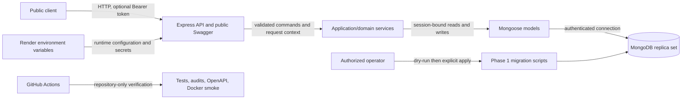

# Architecture Notes

This document describes the main backend architecture and business rules of the Inventory Management API.

The goal is to keep the project close to a realistic inventory and warehouse management backend, without adding unnecessary complexity.

## Domain Overview

The project is built around four main business concepts:

```text
Product
Warehouse
Stock
StockMovement
```

Products and warehouses are master data.
Stock connects products and warehouses.
Stock movements describe why and how inventory quantities change.

## Core Data Relationship

```text
Product
   │
   ▼
 Stock
   ▲
   │
Warehouse
```

A stock record represents the quantity of one product in one warehouse.

The combination of `productId` and `warehouseId` should be unique.
This prevents duplicate stock records for the same product in the same warehouse.

## Stock Movement Principle

Stock quantity must not be changed directly.

All Phase 1 stock changes happen through the implemented business operations:

* Goods receipt
* Goods issue

Each operation creates a stock movement record. Phase 1 exposes no stock-
adjustment or stock-transfer operation.

This keeps stock changes traceable and prevents unexplained quantity changes.

## Product Lifecycle

Products use `status: active | inactive` plus terminal archive metadata. Active
Products may participate in Stock creation and inventory mutations. Inactive
Products remain visible and referenced, block those mutations, and may be
reactivated. The deprecated single and bulk DELETE routes archive only inactive
Products by setting `archivedAt`, `archivedBy`, and optional `archiveReason`.
Archive retains the document and unique SKU but hides it from normal Product
reads and updates. There is no restore or physical-delete API.

Meaningful Product commands increment explicit `version` once. Repeated
already-applied transitions do not increment it. Deactivation metadata is set
on active-to-inactive and cleared on reactivation.

## Warehouse Lifecycle

Warehouses can be created, listed, updated and deactivated.

Inactive Warehouses remain readable, block Stock creation and inventory
mutations, and may be reactivated. Status transitions set or clear deactivation
metadata and increment explicit `version` once; no-op transitions do not.

Warehouse deletion is intentionally not implemented.

Warehouses are connected to stock records, goods receipts, goods issues and movement history.
Deleting a warehouse would make historical inventory data unreliable.

## Business Identifiers

Some fields are treated as business identifiers.

Examples:

* Product SKU
* Warehouse code

Warehouse codes are stored in uppercase and are not changed through the update endpoint.

This keeps warehouse references stable for future stock records, reports and integrations.

## Current Backend Structure

```text
Routes
  ↓
Authentication / RBAC
  ↓
Validators
  ↓
Thin Controllers
  ↓
Inventory or Stock Application Service
  ↓
Transaction Helper for Inventory Mutations
  ↓
Mongoose Models
  ↓
MongoDB
```

Product/Warehouse mutations, goods receipt, goods issue, and Stock setup writes use application services that
accept plain JavaScript input and do not depend on Express request or response
objects. Their controllers translate HTTP input and output only. Product,
Warehouse, Stock, and StockMovement reads use a focused read service that owns
query validation, cursor predicates, projections, population, and limits.

Authentication login, refresh rotation, and logout logic lives in
`src/services/authService.js`; administrative user creation lives in
`src/services/userService.js`. These services accept plain values and own their
persistence and domain-error behavior, while their controllers perform HTTP
input extraction and response presentation only. Inventory mutation execution
remains HTTP-independent in `src/services/idempotencyExecutor.js`; the Express
presentation adapter is `src/http/sendInventoryMutation.js`.

Expected business failures from these services use typed domain errors. The
global error handler preserves their statuses/codes and presents either the v1
machine-readable error envelope or the legacy message-shaped response.

Product and Warehouse lifecycle services transactionally update the parent and
propagate derived lifecycle state to related Stock guards:

```text
Product/Warehouse lifecycle command
  -> compare-and-swap parent version
  -> set or clear lifecycle metadata
  -> propagate Stock guard and increment affected Stock versions
  -> commit
```

Stock creation reads active parent versions and conditionally increments each
distinct parent version before inserting Stock. That increment records the new
aggregate relationship and makes creation conflict with concurrent parent
deactivation.

Goods receipt and goods issue run through a reusable transaction helper. Each
request uses one MongoDB session, and every authoritative Stock and
StockMovement read or write is attached to that session. Stock changes and
movement records therefore commit atomically. Bulk receipt and issue requests
use one transaction for the complete request and are all-or-nothing. The former
manual compensation updates and movement deletes are no longer used.

```text
Inventory transaction
  -> load Stock, Product, and Warehouse in one session
  -> require active authoritative parents, active Stock, and active guards
  -> guarded quantity plus Stock.version update
  -> enriched StockMovement with exact aggregateVersion
  -> commit
```

Both parent reads and derived Stock guards are required. Inventory mutation and
lifecycle propagation write the same Stock document, turning concurrent parent
lifecycle changes into a write conflict instead of permitting write skew.

Transactions require a replica-set or equivalent transaction-capable MongoDB
topology. Tests use a single-node `MongoMemoryReplSet`, and local Docker Compose
uses MongoDB 8 with the single-node replica set `rs0`.

Explicit `version` on Product, Warehouse, and Stock is the domain aggregate
revision; Mongoose `__v` is not. Product/Warehouse mutations always use an
internal compare-and-swap. The current API additionally accepts optional
`expectedVersion`; omission remains backward compatible and can still permit
last-write-wins. Mandatory preconditions are deferred to a versioned contract.

Transaction callback state and movement calculations are attempt-local, so a
driver callback retry does not accumulate versions or response arrays.

## API contracts and bounded reads

One shared API router is mounted first at `/api/v1` and then at the temporary
`/api` compatibility prefix. Contract context is assigned before JSON parsing,
so malformed JSON, authentication, RBAC, validation, rate limiting, route 404s,
domain failures, and unexpected errors all use the correct presenter. Health,
readiness, the root route, and Swagger UI are outside this versioned presenter.

V1 successes are `{data,meta}`. Base metadata always contains the effective
request/correlation IDs and `schemaVersion: "1.0"`; collection metadata also
contains `limit` and nullable `nextCursor`. V1 errors always contain
`type`, `title`, `status`, `code`, `detail`, both context IDs, `retryable`, and a
bounded `errors` array. Legacy successes/errors retain their existing body
shapes. Legacy lists are the deliberate exception to previously unbounded
behavior: they return at most 50 records by default (100 maximum) and place a
continuation token in `X-Next-Cursor`.

Exported Product, Warehouse, Stock, Inventory, and User application-service
boundaries validate caller commands independently of Express. Recognized
caller-invalid input becomes non-retryable `VALIDATION_FAILED`/400 with at most
20 static `{field,message}` details; unknown Mongoose paths or validator kinds,
residual casts, and unexpected persistence failures become non-retryable
`INTERNAL_ERROR`/500 with an operation-safe message. The original exception is
retained only as native `cause` for internal diagnostics and is not copied into
the public contract.

Self-owned service transactions normalize only after `withTransaction` has
finished retry/abort handling. A service called with a caller-owned session
leaves unknown driver errors and their labels unchanged for the outer
transaction owner. The idempotency executor applies final normalization only
after its acquisition and outer transaction flow has completed; retry policy is
therefore unchanged.

The mutation/idempotency/audit/outbox boundary now consumes one strict,
transport-neutral application-context value. Its complete shape contains only
`requestId`, `correlationId`, `causationId`, `source`, and an actor with only
`type` and `id`. All four identity strings are 1-128 characters and match
`^[A-Za-z0-9._:-]+$`; `causationId` must equal `requestId`. Exactly two pairs are
valid: `http-api/user` and `internal/service`. Cross-pairs, arbitrary values,
extra metadata, inherited fields, accessors, and non-plain objects are rejected.

HTTP middleware behavior is unchanged: it still creates the partial pre-auth
context with `source=http-api`, authentication adds a `user` actor, and request
and correlation response headers retain their existing fallback behavior. A
plain non-HTTP caller may now supply `internal/service` to the existing safe
orchestration. AuditEvent, OutboxEvent, and IdempotencyRecord accept and persist
that approved context without adding fields; existing `http-api/user` documents
remain valid. Idempotency uniqueness remains actor type, actor ID, operation ID,
and key hash—source is not part of the scope. No index, TTL, document shape, or
migration changes are required.

This is only a value-contract foundation. It does not implement a worker,
scheduler, event consumer, webhook delivery, n8n workflow, queue integration,
service authentication, or another transport, and it does not imply Phase 1 or
production-readiness completion.

Two v1 negative machine codes are intentionally more precise while legacy
status/message presentation remains compatible. A duplicate Stock combination
inside one submitted bulk command is `VALIDATION_FAILED`/400, while a collision
with persisted Stock remains `DUPLICATE_RESOURCE`/409. Archiving an active
Product is `INVALID_RESOURCE_STATE`/409 with detail `Active products must be
deactivated before deletion`; genuine inactive-Product restrictions continue
to use `INACTIVE_PRODUCT`.

Idempotency records continue storing the contract-neutral legacy-shaped public
result. The presenter applies the requested envelope only after original
execution or replay resolution. Because both aliases share stable business
operation IDs and canonical command hashes, a mutation can execute through one
prefix and replay through the other without another domain write, StockMovement,
AuditEvent, or OutboxEvent.

Collection queries accept only scalar allowlisted parameters. All four support
`limit`, `cursor`, `sort=createdAt`, and `order=asc|desc`. Product filters are
`status` and exact normalized `sku`; Warehouse filters are `status` and exact
normalized `code`; Stock filters are `productId`, `warehouseId`, and `status`;
StockMovement filters are `stockId`, `productId`, `warehouseId`, `type`, exact
`reference`, and inclusive timezone-qualified `from`/`to` timestamps. Unknown
keys, arrays, objects, MongoDB operators, arbitrary projection/population,
search, and alternate sort fields fail validation before Mongoose receives a
query.

The cursor is canonical base64url JSON containing only version, resource, sort,
order, last `createdAt`, last `_id`, and a SHA-256 fingerprint of the normalized
resource/filter/sort contract. Descending reads use `createdAt < boundary OR
(createdAt == boundary AND _id < boundaryId)`; ascending reads invert both
comparisons. Each query fetches `limit + 1`, returns no more than `limit`, and
creates a next cursor only when the extra row exists. No count query is issued.
This is deterministic for a stable dataset, not snapshot isolation across
concurrent writes.

Public read DTOs use explicit `.select(...)`, `.lean()`, and bounded Product,
Warehouse, and Stock populations. Canonical v1 mutation responses pass through
explicit Product, Warehouse, Stock, StockMovement, bulk, lifecycle, and
inventory-result presenters after fresh or replayed idempotent execution. These
presenters allowlist documented fields, preserve domain `version` and
`aggregateVersion`, and exclude Mongoose `__v`; legacy presentation and the
contract-neutral stored idempotency body are unchanged. The supporting index
families place equality fields first and `createdAt, _id` last:

- Product: `(archivedAt, createdAt, _id)` and
  `(archivedAt, status, createdAt, _id)`; the existing unique SKU index handles
  exact SKU lookup.
- Warehouse: `(createdAt, _id)` and `(status, createdAt, _id)`; the existing
  unique code index handles exact code lookup.
- Stock: `(createdAt, _id)` plus Product, Warehouse, and status variants; the
  existing unique `(productId, warehouseId)` index handles the combined exact
  relationship.
- StockMovement: `(createdAt, _id)` plus stock, Product, Warehouse, type, and
  reference equality variants. Multi-filter queries deliberately use this
  minimal set with bounded results instead of every compound permutation.

Production connection setup disables Mongoose automatic index creation. The
explicit `phase1ApiReadIndexes` migration first requires all four model-derived
collections and semantically verifies the pre-existing unique Product SKU,
unique Warehouse code, unique ordered Stock Product/Warehouse, and unique
partial StockMovement stock/aggregate-version indexes. It then classifies the
WP7 read indexes. Missing collections, missing/incompatible prerequisites,
incompatible read indexes, or invalid `createdAt` data block both modes before
any index write. The migration never creates collections or repairs
prerequisite indexes; a clean apply creates only absent compatible WP7 read
indexes.

## Request Context

The first application middleware accepts one inbound `X-Request-ID` and
`X-Correlation-ID` only when each is 1-128 characters matching
`^[A-Za-z0-9._:-]+$`. A missing, repeated, overlong, or otherwise invalid
request ID is replaced with a UUID. An invalid or missing correlation ID
defaults to the effective request ID. Raw invalid values are neither reflected
nor logged. Both effective headers are written before parsing, authentication,
or routing so success and error paths carry them.

The context passed explicitly through controllers and application services is:

```text
{ requestId, correlationId, causationId, source: "http-api", actor: { type: "user", id } }
```

Authentication supplies the actor from the validated User record. The context
does not contain raw headers, JWTs, roles, email, or names. There is no
AsyncLocalStorage or mutable global request state. For HTTP mutations,
`causationId` is the effective request ID; inbound causation headers are not
accepted.

## Runtime Operations

The Express app remains independently importable and does not connect, listen,
register signal handlers, or exit during import. The executable entry point
owns the process lifecycle:

```text
validate environment
  -> mark starting and connect to MongoDB
  -> await the required connection
  -> open and confirm the HTTP listener
  -> mark accepting traffic
  -> emit application_ready
```

One small process-local lifecycle instance represents `starting`, `ready`,
`shutting_down`, `stopped`, and `failed`. Readiness requires both its accepting
traffic state and Mongoose `readyState === 1`; a stored boolean therefore cannot
mask a database disconnect. `/health/live` and legacy `/health` are independent
of MongoDB. `/health/ready` and the WP6 compatibility readiness alias
`/api/ready` return a bounded `503` response while starting, disconnected, or
shutting down. All four routes are public and run after request-context
creation.

`SIGTERM` and `SIGINT` share one shutdown promise:

```text
mark shutting_down
  -> stop accepting new HTTP connections
  -> await active HTTP requests and close the listener
  -> close Mongoose
  -> mark stopped and exit successfully
```

The sequence has a fixed ten-second bound. On timeout it force-closes remaining
HTTP connections when the Node.js server supports that operation, makes one
best-effort database close, records a sanitized timeout event, and exits
non-zero. Repeated signals cannot close either resource twice.

Pino writes structured application and HTTP terminal records as one JSON
object per line. Event-specific allowlists admit request/correlation IDs,
method, normalized route or query-free path, final status, monotonic duration,
authenticated actor type/ID, safe error code/retryability, and operational
lifecycle fields. Logger redaction provides a second defense for sensitive key
names. Raw request/response objects, bodies, headers, query values, credentials,
tokens, cookies, user names/emails/roles, database URIs, raw idempotency keys,
and production stacks do not cross the logging boundary. A response `finish`
emits `http_request_completed`; a preceding connection `close` instead emits
`http_request_aborted`. Both paths share one terminal guard.

Operational logs are not `AuditEvent` records and do not participate in domain
transactions. They do not write to MongoDB or create `OutboxEvent` records.
Transactional Audit/Outbox persistence remains the authoritative business
change record, and Outbox delivery remains deliberately deferred.

## Inventory Mutation Idempotency

Every exposed Product, Warehouse, Stock, Goods Receipt, and Goods Issue
mutation maps to one explicit versioned business operation ID. GET, auth, user,
Swagger, health, and read-only StockMovement operations do not enter the
idempotency executor.

After authentication, RBAC, validation, and normalization, controllers build a
plain command containing the operation ID, normalized path parameters,
semantic query parameters, and normalized body. `canonical-json-v1` recursively
sorts plain-object keys, preserves array order and JSON types, normalizes
ObjectIds/dates, and rejects unsupported or circular values. SHA-256 hashes both
the canonical command and the raw opaque key; the raw key is never persisted.

The unique scope is `(actorType, actorId, operationId, keyHash)`. The common
mutation executor owns one transaction for keyed and unkeyed HTTP writes. For a
keyed original it inserts an internal `processing` record, runs the
session-bound domain operation and movement writes, persists Audit and Outbox
records, constructs a plain JSON response snapshot, enforces the 1 MiB limit,
and changes the record to `completed`. A failed transaction commits no record,
and no committed `failed` state exists. Direct service use retains a fallback
transaction, while route execution always supplies the executor-owned session,
avoiding nested transactions.

MongoDB's unique compound index prevents concurrent duplicate commits. A loser
resolves the committed record in at most three bounded attempts. Matching
request hashes replay the stored contract-neutral result without another domain
write and the HTTP presenter applies the requested legacy or v1 contract;
different hashes return 409. Authentication and RBAC always run before replay.
Completed records expire seven days after completion through a single-field TTL
index. TTL removal is asynchronous; until removal the stored record remains
authoritative. Runtime auto-index creation is disabled for the record model; the
dry-run-first migration owns production index creation. No Redis lock,
application cleanup worker, lease, or heartbeat is used.

## Audit and Transactional Outbox

Every successful Inventory Core HTTP mutation uses one atomic boundary:

```text
domain mutation
+ StockMovement (when applicable)
+ AuditEvent
+ OutboxEvent for each actual version transition
+ keyed IdempotencyRecord completion (when applicable)
= one MongoDB transaction
```

An attempt-local collector receives plain transition descriptors from domain
services. It performs no writes and is recreated if the MongoDB driver retries
the transaction callback. The persistence service validates every descriptor,
snapshot, metadata object, payload, and model envelope before the first event
insert. Audit rows are inserted in operation order, followed by Outbox rows in
the same order. Domain services do not import either event model.

Event granularity follows aggregate versions. Each actual Product, Warehouse,
or Stock version transition creates one AuditEvent and one OutboxEvent. Bulk
commands create independent per-aggregate records, repeated Stock movements
retain sequential versions, and Stock creation creates events for each distinct
parent version touch. A successful no-op creates one `no_change` AuditEvent with
equivalent before/after hashes and no OutboxEvent. Idempotency replay, conflict,
validation, authorization, and failed domain transactions create no events.

AuditEvent is append-only and contains only the authenticated actor type/ID,
stable operation ID, aggregate identity/version, outcome, request context,
optional hashed idempotency reference, allowlisted before/after snapshots and
bounded metadata. The exact Product snapshot keys are `id`, `sku`, `unit`,
`status`, `version`, `deactivatedAt`, `deactivatedBy`,
`deactivationReason`, `archivedAt`, `archivedBy`, and `archiveReason`. The exact
Warehouse keys are `id`, `code`, `status`, `version`, `deactivatedAt`,
`deactivatedBy`, and `deactivationReason`. The exact Stock keys are `id`,
`productId`, `warehouseId`, `quantity`, `status`, `version`,
`productLifecycleStatus`, and `warehouseLifecycleStatus`. Undefined keys are
omitted and meaningful nulls remain. Product/Warehouse names and descriptions
are deliberately excluded because they are free-form text; deterministic
`changedFields` still records those updates. Mongoose internals and generic
creation/update timestamps are excluded because they are not approved event
contract fields. Snapshot and metadata limits are each 16,384 UTF-8 bytes.
Snapshot hashes use `canonical-json-v1` and SHA-256. There is no failure-audit
record and no Audit TTL in this work package.

OutboxEvent uses stable registry-controlled event types with `eventVersion: 1`
and `payloadSchemaVersion: 1`, the exact aggregate version, the same request
context/idempotency reference as its Audit pair, and an event-specific payload
limited to 65,536 UTF-8 bytes. Delivery begins as `pending` with zero attempts
and `nextAttemptAt` equal to `occurredAt`. No polling, delivery, retry,
dead-letter, webhook, or external publication worker exists yet. Pending rows
therefore accumulate, and neither Audit nor Outbox has a TTL.

The version-1 registry contains exactly `catalog.product.created`,
`catalog.product.updated`, `catalog.product.reactivated`,
`catalog.product.deactivated`, `catalog.product.archived`,
`catalog.product.stock-linked`, `warehouse.created`, `warehouse.updated`,
`warehouse.reactivated`, `warehouse.deactivated`, `warehouse.stock-linked`,
`inventory.stock.created`, `inventory.stock.received`,
`inventory.stock.issued`, and
`inventory.stock.availability-guard-changed`. Payload builders reject unknown
or extra fields and enforce deterministic changed/link lists, lifecycle status
direction, movement arithmetic, and aggregate identity/version agreement.

## Stock Aggregate Design

Stock is the association between Product and Warehouse. Its integrity fields are:

```text
productId
warehouseId
quantity
status
version
productLifecycleStatus
warehouseLifecycleStatus
```

Lifecycle guards are derived transactionally from parents and are not separate
business truth. Missing legacy guards fail closed until migration. Guard changes
do not overwrite Stock's own status. Quantity is updated only by controlled
inventory operations.

There should be no direct endpoint such as:

```http
PATCH /api/stocks/:id
```

for manually changing quantity.

## Stock Movement Design

Stock movements document inventory changes. New writes include:

```text
productId
warehouseId
type
quantity
reference
reason
quantityBefore
quantityAfter
aggregateVersion
productSnapshot { sku, name }
warehouseSnapshot { code, name }
createdAt
```

Current movement types:

```text
GOODS_RECEIPT
GOODS_ISSUE
```

Direct parent references avoid dependence on nested Stock population. Snapshots
remain immutable after parent rename or archive. Repeated Stock IDs in a bulk
request retain input order and receive sequential before/after quantities and
aggregate versions. Additive schema fields remain optional so legacy rows stay
readable; historical values predating the cutover are not fabricated.

The controlled migration creates a unique partial index on
`{ stockId, aggregateVersion }` for numeric aggregate versions only, after its
duplicate-candidate preflight succeeds.

## Development Principle

The project follows a business-first approach.

Before adding a feature, the main question is:

```text
Would this behavior still make sense in a real inventory system?
```

If the answer is no, the feature should not be added only to make the project larger.

---

## Guiding Principle

The project is designed around business processes instead of CRUD operations.

Business rules define how data changes.

The API should reflect real inventory workflows rather than direct database manipulation.

Whenever possible, inventory changes should be represented as business transactions instead of simple field updates.

## Phase 1 system and deployment boundaries

The end-of-Phase-1 system remains a JavaScript/CommonJS modular monolith. HTTP
presentation, application/domain coordination, and persistence have explicit
responsibilities, while one process and one MongoDB deployment keep operational
complexity appropriate to the project.



The HTTP layer assigns the legacy or v1 contract, authenticates and authorizes,
validates input, and translates between Express and plain service commands.
Controllers do not own transaction or domain rules. Application services own
lifecycle, optimistic compare-and-swap, referential integrity, inventory
arithmetic, idempotent execution, and transactional event collection. Mongoose
models own persistence shape and schema indexes; explicit migrations own
production index rollout. Inventory, StockMovement, AuditEvent, OutboxEvent, and
keyed IdempotencyRecord completion share the appropriate MongoDB transaction.

Canonical `/api/v1` uses `{data,meta}` success envelopes and a stable
machine-readable error object. The temporary `/api` alias uses the same router
and domain behavior with legacy presentation. All collection reads are bounded,
use allowlisted filters and projections, and implement `(createdAt, _id)` cursor
pagination. The read-index strategy places exact equality fields before that
cursor boundary and deliberately avoids every possible filter permutation.

## Configuration and release topology

`src/config/environment.js` parses supported runtime environments, ports,
MongoDB schemes, JWT lifetime, bounded connection retries, and the public
Swagger URL before any database connection or HTTP listener. Production also
rejects short and known-placeholder JWT secrets. Validation returns normalized
configuration without mutating global state or including rejected values in
errors. Admin seed values are validated by a separate seed-only entry point and
are not API startup requirements.

The Dockerfile builds from Node 22 Alpine, installs production dependencies,
defaults to `NODE_ENV=production`, exposes port 3000, and runs as `node`.
Compose overrides the runtime to `development` because it is the documented
local topology; it retains the same production-built image, a persistent MongoDB
8 single-node replica set, health checks, and an explicit seed profile. This
keeps local placeholders usable without weakening production validation.
Render remains the production topology: the platform injects MongoDB and JWT
secrets, the service starts with `NODE_ENV=production`, and `/health` is the
configured liveness path.

GitHub Actions has read-only repository permissions and no application,
database, or deployment credentials. Its gates are deterministic install,
production and full dependency audits, repository/security and syntax checks,
the complete Jest suite, formal OpenAPI validation, Docker build, Compose
configuration, and an isolated local runtime smoke test. It neither deploys nor
runs a remote migration. Database migrations remain dry-run-first operator
procedures in `docs/production-data-notes.md`.

## Trust boundaries

- **Public client to API:** every value is untrusted. Helmet, body/query
  validation, bounded JSON, rate limiting, request-context validation, and the
  public error presenters constrain this boundary.
- **Authenticated API boundary:** a verified JWT identifies an active User;
  RBAC is applied before protected controllers and before idempotent replay.
- **Application to MongoDB:** only configured application/model code constructs
  queries. Transactions, conditional updates, indexes, and schema validation
  protect consistency; the connection credential stays outside source and logs.
- **Deployment platform to secrets:** Render injects values at runtime. Startup
  validates their shape and production policy but never prints them.
- **CI to repository:** CI checks repository and local containers only. It has no
  Atlas/Render credentials and no release mutation authority.
- **Operator to migrations:** the operator chooses the exact database, reviews
  dry-run evidence and backups, authorizes apply, and performs post-apply index
  and smoke verification.

## Intentional Phase 1 limitations

Public Swagger is intentional for portfolio and demo visibility; protected
operations still require Bearer authentication and RBAC. Outbox records are
persisted atomically but are not delivered. Phase 1 has no delivery worker,
webhook delivery, n8n integration, external message broker, machine-to-machine
or service-to-service authentication, frontend, microservice decomposition,
AWS deployment, distributed tracing platform, SIEM integration, managed secret
platform, advanced load testing, multi-region deployment, Orders domain, or
Suppliers domain. Those limits are explicit rather than implied future behavior.
